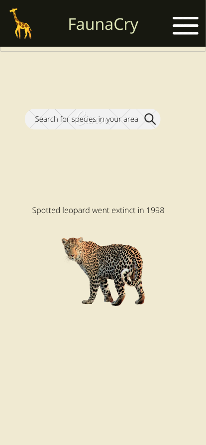
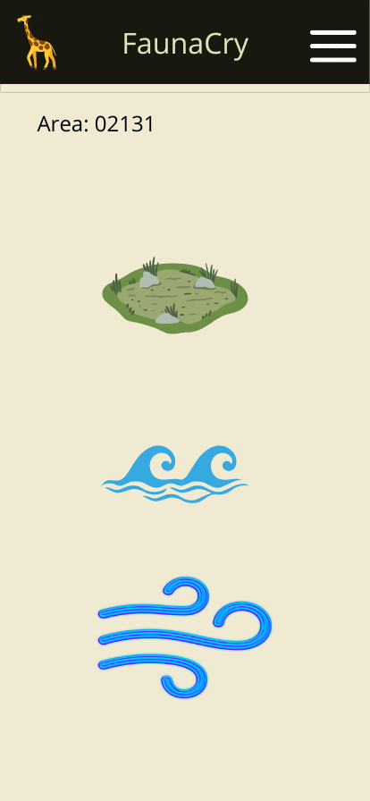
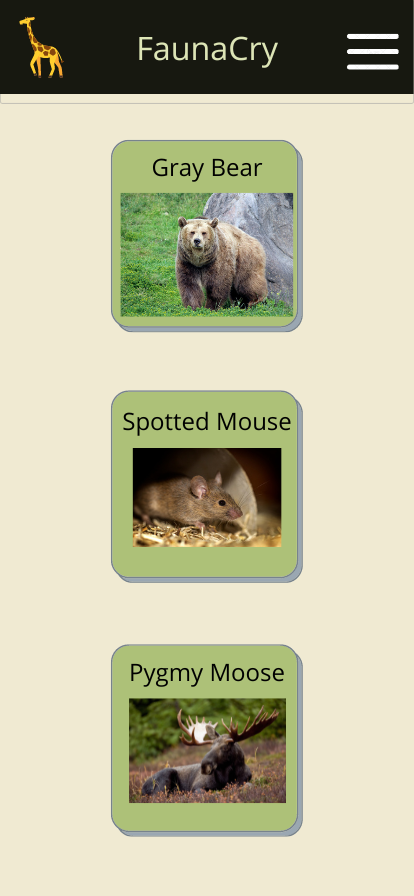
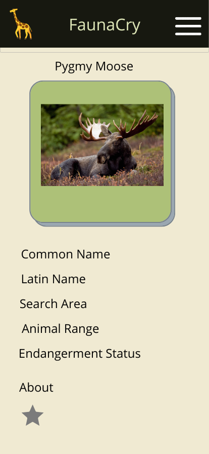
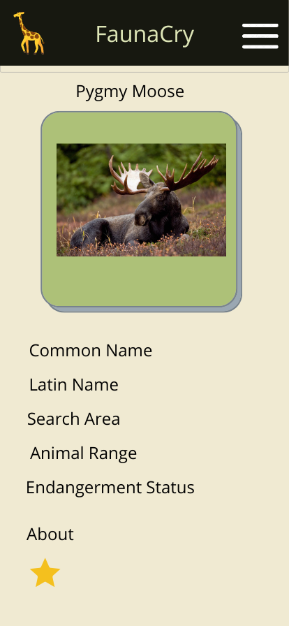
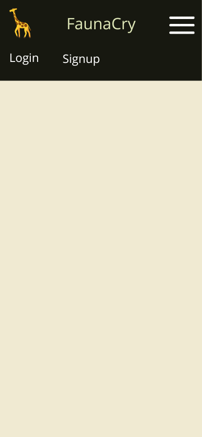
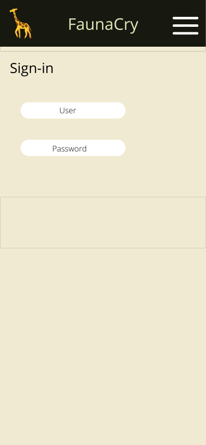
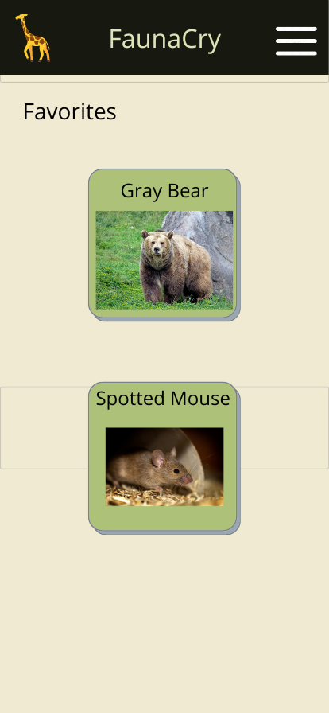
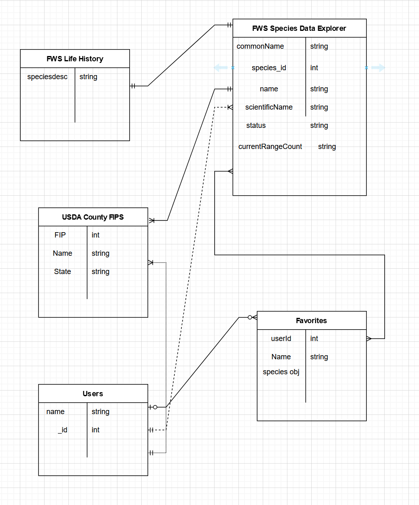

# FaunaCry

FaunaCry is a lean informational app to help raise awareness about the increasing thread of species extinction. The app can help search for endangered species in your area. Enter your state and see a list of all the species that are endangered near you.

Use: Enter a location to get a list of species.

Functionality: 
- location-based
- mobile first
- navigate by click / push
- visual in nature
- get a listing of the species 
- get a photo of the species
- searches for closest match then expands outward if none are found
- ways to help resources
- basic web-scraping if needed
- basic User Login
- Save favorite species

Technologies:
- Javascript
- Node.js
- Mongodb - module
- Mongoose - module
- dotEnv - module
- Nodemon - module
- MethodOverride - module
- bcyrpt - module
- Express - module
- Liquid-express-views - module
- Express-session - module
- CSS - Bootstrap framework

Models:
- Environmental Conservation Online System (ECOS) U.S. Fish & Wildlife Service API
        - https://ecos.fws.gov/ecp/report/adhocDocumentation?catalogId=species&reportId=pr
- Users
- Favorite animal save
- Location information
    - https://www.nrcs.usda.gov/wps/portal/nrcs/detail/national/home/?cid=nrcs143_013697
- Wikipedia API for information or photos
- University of Michigan Museum of Zoology - Animal Diversiety Web - https://animaldiversity.org/ (scrape)
- Animal habitat classifier: air, earth, or water

Color scheme:
f0ead2
dde5b6
adc178
a98467
6c584c
000000
ffffff

As-a-User:
- Open the webapge and see a location submit form. You will be presented with few examples of recently extinct species underneath search that randomizes each visit
- Login via the top navigation bar if desired
- Submit location and be presented with icons of general location ranges: air, earth, or water
- If earth is chosen you are presented with a list of all the species that are 'earth based'
- You are presented with all the species from the 'earth' category
- Click on a species get a new page
- New page includes an indivdual species with facts: Animal Photo, Common Name, Latin Name, Search Area, Animal Range, Level of Endangerment, Brief Animal Bio
- If you are logged-in you can 'star' a species
- Navigate back to search by clicking on link in navigation bar
- If logged in, Favorites will show in navigation bar
- Click into Favorites
- Show a list of Favorites
- Go back to main search by clicking on link in navigation bar

Wireframes:

Route Table:

|   NAME   |     PATH                        | HTTP VERB |            PURPOSE                   |
|----------|---------------------------------|-----------|--------------------------------------| 
| Index    | /faunacry                       |    GET    | Main page shows location search      |
| New      | /faunacry/favorite              |    GET    | Adds new favorite to species         |
| Create   | /faunacry/favorite/:id          |   POST    | Creates a favorite species           |
| Show     | /faunacry/:id                   |    GET    | Shows the species per area           |
| Edit     | /faunacry/favorite/:id/edit     |    GET    | Shows edit form for users favorites  |
| Update   | /faunacry/favorite/:id/edit     |    PUT    | Updates a favorite                   |
| Destroy  | /faunacry/favorite/:id/delete   |   DELETE  | Deletes a favorite                   |

ERD:

Webiste Link: 
https://sheltered-reaches-05567.herokuapp.com/